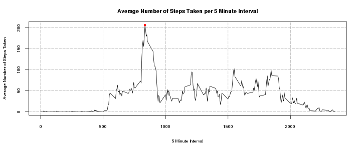
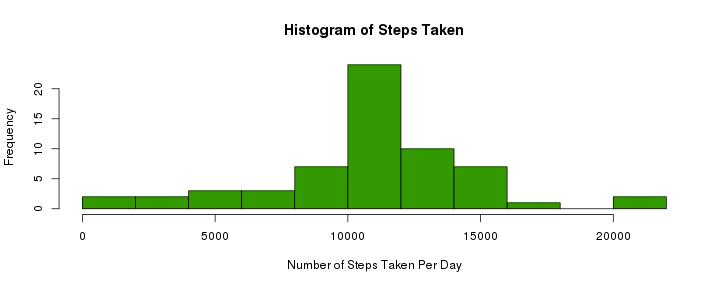
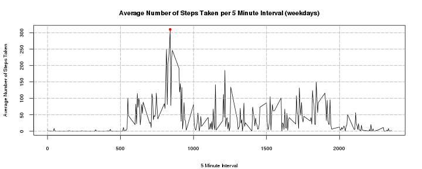
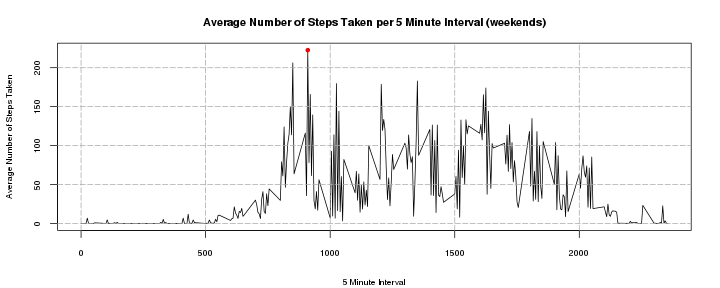

Personal Activity Monitor Data Analysis
=======================================================

Loading the Dataset
=======================

The data for this assignment comes from the Coursera John's Hopkins Data Science Course Reproducible Research.

The data was described as "two months of data from an anonymous individual collected during the months of October and November, 2012 and include the number of steps taken in 5 minute intervals each day."


```r
if (file.exists("activity.csv")) {
} else {
  unzip("activity.zip")
}
```

```
## NULL
```

The original data set consists of three columns of data.
Column 1 - Number of Steps
Column 2 - Date
Column 3 - 5 Minute Interval

eg:


```r
data1<-read.csv("activity.csv")
print(data1[1:5,])
```

```
##   steps       date interval
## 1    NA 2012-10-01        0
## 2    NA 2012-10-01        5
## 3    NA 2012-10-01       10
## 4    NA 2012-10-01       15
## 5    NA 2012-10-01       20
```

Mean Total Number of Steps Taken Per Day
====================================

```r
dLevels<-levels(data1[,2])
dFrame<-data.frame(dLevels, sum = as.numeric(1:length(dLevels)), 
                   mean=as.numeric(1:length(dLevels)), 
                   median=as.numeric(1:length(dLevels)))
counter1<-1
for (i in dLevels)
{
  dFrame[counter1,2]<-sum(data1[data1[,2] == i,1])
  dFrame[counter1,3]<-mean(data1[data1[,2] == i,1])
  dFrame[counter1,4]<-median(data1[data1[,2] == i,1])
  counter1<-counter1 + 1
}
```

 
The Mean Number of Steps Taken per Day is:

```r
mean(dFrame[!is.na(dFrame[,2]), 2])
```

```
## [1] 10766
```
The Median Number of Steps Taken per Day is:

```
## [1] 10765
```

Average Daily Activity Pattern
=====================

```r
iLevels<-levels(as.factor(data1[,3]))
interVals<-data.frame(iLevels, avg_steps = as.numeric(1:length(iLevels)),
                      sum = as.numeric(1:length(iLevels)))
counter1<-1
for (i in iLevels)
{
  interVals[counter1,2]<-mean(data1[data1[,3] == i & !is.na(data1[,1]),1])
  interVals[counter1,3]<-sum(data1[data1[,3] == i & !is.na(data1[,1]),1])
  counter1<-counter1 + 1
}


par(mar=c(4,4,3,2))
plot(as.numeric(as.character(interVals[,1])), interVals[,2], type="l",
     xlab="5 Minute Interval",
     ylab="Average Number of Steps Taken", 
     cex.axis=0.7, cex.lab=0.7)
title(main="Average Number of Steps Taken per 5 Minute Interval", cex.main=0.9)
points(as.numeric(as.character(interVals[interVals[,2] == max(interVals[,2]),1])), 
       max(interVals[,2]), pch=19, col="red", cex=0.7)
grid(NULL, NULL, lty=5, col="#AAAAAA")
```

 

```r
print(paste("The maximum average number of steps ", 
            round(max(interVals[,2]), digits=2), 
            " occurs in interval ", 
            interVals[interVals[,2] == max(interVals[,2]),1], sep=""))
```

```
## [1] "The maximum average number of steps 206.17 occurs in interval 835"
```

Inputting Missing Values
=====================

A number of values in the original data set were missing. Missing values were added by substituting the average number of steps for that time period.


```r
naCounter<-0
data2<-data1
for (anCounter in 1:length(data1[,1]))
{
  if (is.na(data1[anCounter, 1]))
  {
    naCounter<-naCounter + 1
    data2[anCounter,1]<-round(interVals[interVals[,1] == data1[anCounter,3],2])
  }
}
print(paste("The Count of NA Values is: ", naCounter, sep=""))
```

```
## [1] "The Count of NA Values is: 2304"
```

```r
dLevels2<-levels(data2[,2])
dFrame2<-data.frame(dLevels2, sum = as.numeric(1:length(dLevels2)), 
                   mean=as.numeric(1:length(dLevels2)), 
                   median=as.numeric(1:length(dLevels2)))
counter2<-1
for (i in dLevels2)
{
  dFrame2[counter2,2]<-sum(data2[data2[,2] == i,1])
  dFrame2[counter2,3]<-mean(data2[data2[,2] == i,1])
  dFrame2[counter2,4]<-median(data2[data2[,2] == i,1])
  counter2<-counter2 + 1
}
hist(dFrame2[,2], breaks=10, xlab="Number of Steps Taken Per Day",
     main="Histogram of Steps Taken", col="#339900")
```

 

The Mean Number of Steps Taken per Day is:

```r
mean(dFrame2[!is.na(dFrame2[,2]), 2])
```

```
## [1] 10766
```
The Median Number of Steps Taken per Day is:

```r
median(dFrame2[!is.na(dFrame2[,2]), 2])
```

```
## [1] 10762
```
The addition of estimate data does not appear to impact the Mean or Median greatly.

Differences between weekdays and weekends
===============================
Using the weekday function, the day of the week was added to the data set.


```r
data2["weekday"]
```

```
## Error: undefined columns selected
```

```r
data2$weekday<-weekdays(as.POSIXct(data2[,2]))
```

The graphs of average number of steps taken for weekdays and weekends follow:


```r
#levels for graph of 5 min interval--------------------------------------------
iLevels2<-levels(as.factor(data2[,3]))
#Intervals for weekdays--------------------------------------------------------
interVals2wd<-data.frame(iLevels2, avg_steps = as.numeric(1:length(iLevels2)))
#Intervals for weekends--------------------------------------------------------
interVals2we<-data.frame(iLevels2, avg_steps = as.numeric(1:length(iLevels2)))
weekDays=c("Monday", "Tuesday", "Wednesday", "Thursday", "Friday")
weekEnds=c("Saturday", "Sunday")
counter3<-1
for (i in iLevels2)
{
  interVals2wd[counter3,2]<-mean(data2[data2[,3] == i 
                & !is.na(data2[,1]) 
                & data2[,4] == weekDays,1])
  interVals2we[counter3,2]<-mean(data2[data2[,3] == i 
                & !is.na(data2[,1]) 
                & data2[,4] == weekEnds,1])
  counter3<-counter3 + 1
}

par(mar=c(4,4,3,2))
plot(as.numeric(as.character(interVals2wd[,1])), interVals2wd[,2], type="l",
     xlab="5 Minute Interval",
     ylab="Average Number of Steps Taken", 
     cex.axis=0.7, cex.lab=0.7)
title(main="Average Number of Steps Taken per 5 Minute Interval (weekdays)", cex.main=0.9)
points(as.numeric(as.character(interVals[interVals2wd[,2] == max(interVals2wd[,2]),1])), 
       max(interVals2wd[,2]), pch=19, col="red", cex=0.7)
grid(NULL, NULL, lty=5, col="#AAAAAA")
```

 

```r
par(mar=c(4,4,3,2))
plot(as.numeric(as.character(interVals2we[,1])), interVals2we[,2], type="l",
     xlab="5 Minute Interval",
     ylab="Average Number of Steps Taken", 
     cex.axis=0.7, cex.lab=0.7)
title(main="Average Number of Steps Taken per 5 Minute Interval (weekends)", cex.main=0.9)
points(as.numeric(as.character(interVals2we[interVals2we[,2] == max(interVals2we[,2]),1])), 
       max(interVals2we[,2]), pch=19, col="red", cex=0.7)
grid(NULL, NULL, lty=5, col="#AAAAAA")
```

 

